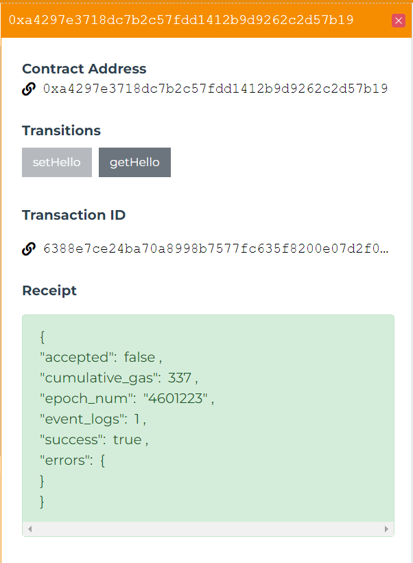
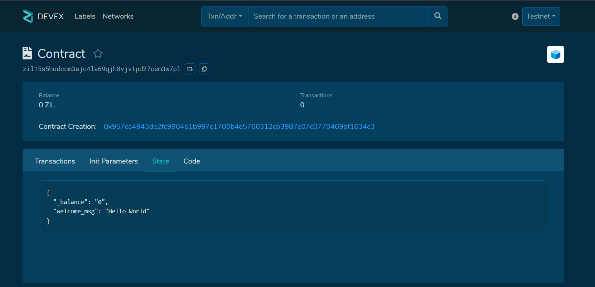

## The Hello World Smart Contract

An immutable contract parameter owner to be initialised by the creator of the contract. owner will be of type ByStr20 (a hexadecimal Byte String representing a 20 byte address).

# The first step is to declare the Scilla version that we will be using for the smart contract.

A mutable field welcome_msg of type String initialised to an empty string ( "" ).
Only the owner should be able to modify the welcome_msg through an interface setHello. The interface takes a msg (of type String) as input and allows the owner to set the value of welcome_msg to msg.
An interface getHello that welcomes any caller with welcome_msg. getHello will not take any input.

# Next, declare the libraries that we will use for this smart contract. In this example, the library will include the definition of some error codes. 
Here, not_owner_code is set to the value of 1 and set_hello_code is set to the value of 2.

# Declare the contract with its immutable parameters and mutable fields.

The Contract has an immutable parameter owner which represents the owner of the smart contract, and a mutable field welcome_msg which represents the welcome message 
that is stored in the smart contract. 
The default value of welcome_msg is set to an empty string.

The next step is to define the transitions in the smart contract. Recall - transitions are a way to define how the state of the contract may change. 

The transitions of a contract are like public interfaces for the contract, which can be invoked by sending messages to the contract. In this example, 
we will be writing two transitions: setHello and getHello to set the welcome message and retrieve the welcome message respectively.

In the transition, the welcome_msg mutable field is read and stored into r, which is then included into the event that is emitted at the end of the transition.

